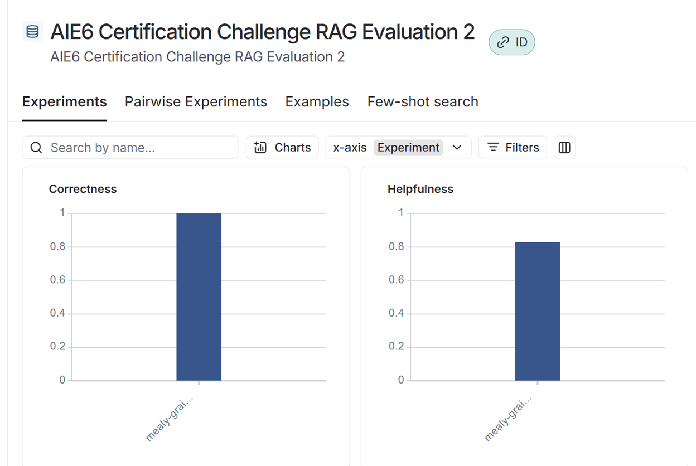

Session 11 – Certification Challenge

Report

What problem do you want to solve? Who is it a problem for?

The goal of this project is to solve the problem of quickly accessing accurate and detailed information about U.S. cities from both static documents and live web data, without requiring manual research or navigation across multiple sources.

This is a challenge for:

Students and researchers who need fast access to historical, geographical, or demographic information about cities.

Travel planners who want up-to-date travel and weather information for multiple cities.

Policy makers, analysts, or business consultants who need contextual data and documentation about urban regions from archived reports, brochures, PDFs, or regulatory documents.

General users who want a conversational, AI-powered way to query city information or scan internal PDFs for location-based data.

Traditionally, gathering this information involves:

Reading large PDF reports

Manually searching web sources for latest updates (e.g., weather, current events)

👉 This app eliminates that fragmentation by providing an intelligent, interactive assistant that can:

Extract information from internal PDF documents (RAG-based retrieval)

Query live city information like current weather etc (via Tavily web search fallback)

Deliver coherent, conversational responses in seconds

In short: this app solves the time-consuming, fragmented nature of city data research.

"Manually gathering accurate, up-to-date information about cities from both internal documents and online sources is time-consuming and inefficient for researchers, planners, and everyday users."

Why this is a problem for the user

For students, researchers, travel planners, and business analysts, the process of retrieving city-specific information is often fragmented and inefficient. Internal documents like reports, research papers, and policy documents are typically stored in unstructured formats such as PDFs, requiring manual reading and extraction of relevant data. Simultaneously, current information such as city demographics, attractions, or weather must be searched separately across multiple websites, which wastes time and increases the chance of missing or misinterpreting important details.

This disjointed workflow leads to delays, errors, and frustration, especially when users need to compare data across multiple cities or when quick decisions must be made. There is a clear need for a unified, intelligent system that can seamlessly access internal document knowledge and supplement it with real-time web search results to provide accurate, context-rich answers in a conversational format.

Tech-Stack and Tooling

Component

Tool

Reason for Choice

LLM

gpt-4o-mini

Chosen for its strong conversational ability and reliable performance in understanding complex user queries about cities and documents.

Embedding Model

fine-tuned snowflake-arctic-embed-m

Custom fine-tuned embedding model improves document retrieval accuracy and relevance specific to the domain.

Orchestration

LangGraph

Enables structured, multi-step workflows combining RAG and external API tools with clear control of state and execution paths.

Vector Database

Qdrant

Efficient, scalable vector search engine optimized for fast similarity searches on large document collections.

Monitoring

LangSmith

Provides detailed tracing, evaluation, and experiment tracking of model runs and workflows to ensure quality and transparency.

User Interface

Streamlit

Allows rapid development of a simple, interactive web application with minimal overhead, perfect for AI prototypes and demonstrations.

LangSmith Evaluation Report

Evaluated RAG based on helpfulness and correctness metrics. Below are screenshots of evaluation.

Images 2

